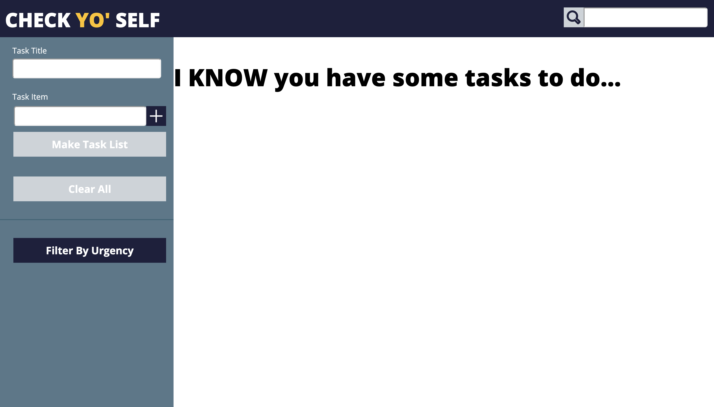
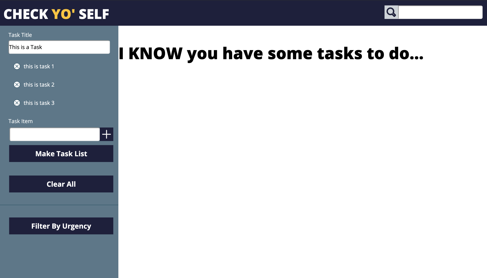
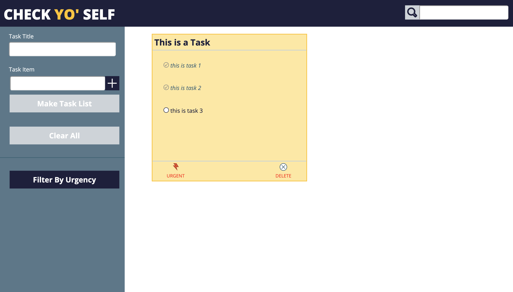

# Check Yo'Self 
## Roger Hughes Check Yo'Self final project submission 

### Learning Goals
1. Write dry/clean code
2. Understanding JSON and passing objects within objects
3. More responsive CSS desktop layout
4. Good work habits/work flow

### My Experience
1. Several road blocks with list implementation within the object
2. Multiple pariring sessions to get over road blocks
3. Heavy refrencing of Idea Box submission
4. Better grasp of Vanilla JS

### Tech Used
- JavaScript
- HTML5
- CSS
- JSON

### Desktop Comp Recreation

